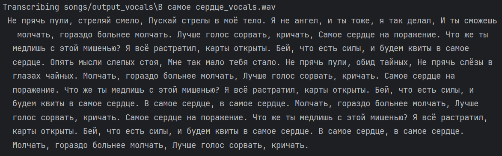

# SingT | D1.2 Report

## Team

| Name                   | Innomail                          | Role                        |
| ---------------------- | --------------------------------- | --------------------------- |
| Apollinaria Chernikova | a.chernikova@innopolis.university | Data Scientist, ML Engineer |
| Egor Machnev           | e.machnev@innopolis.university    | Data Engineer, MLOps        |

## Repository

https://github.com/ApollyCh/SingT

## Project Topic

Song Lyrics Summary Generation Bot with Audio Processing and Translation

## What has been done so far

### Lyric extraction from audio file

The main goal was to clearly extract all lyric part from song. To reach it, we
used
[Demucs](https://github.com/facebookresearch/demucs?ysclid=m1xsfmkm3s829071010)
for vocal extraction and
[Whisper](https://github.com/openai/whisper?ysclid=m1xsg6t06m802685681) for
audio-to-text process.

The results we got is definitely good. For experiment, we used two different
songs on English and on Russian. In both cases all lyric text was extracted
correctly:

### Model selection

Also, we experiment with the models that we potentially could use for lyric
summarization. From experiments, we noticed that special models for
summarization problems do not fit at all for our purpose. Such models cannot
extract the meaning. Usually, its just shrink the text without deep details
proposition. Hence, we choose to use LLMs in our project. The best approaches
were the following models:

- [meta-llama/Llama-3.2-1B](https://huggingface.co/meta-llama/Llama-3.2-1B)
- [google Gemini AI](https://gemini.google.com)

Two approaches give us good results. However, we notice that sometimes
**meta-llama/Llama-3.2-1B** works unstable, when we ask it. Anyway, for the
future, we continue to fine-tune this model for better results.

Example for chinese song "Red Sun in The Sky":

### Text translation

For text translation we choose do not use LLMs, we decided to use
[Google Translate API](https://cloud.google.com/translate/docs/reference/api-overview).
It is much faster. Also, our task does not need to translate text with special
way.

For language detection we use **langid** library.

## Plans for next week

- Continue experiment with model fine-tuning
- Checking multilanguage possibilities for audio-to-text processes
- Start writing link YouTube parser
